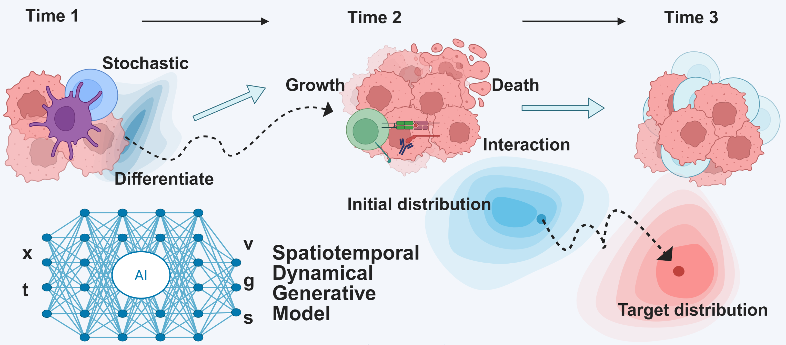

<!-- PROJECT LOGO -->
<br />

<div align="center">
  <a href="https://github.com/zhenyiizhang/CytoBridge/">
    
  </a>


  <h3 align="center">CytoBridge: A Toolkit for Single Cell Spatiotemporal Dynamical Generative Modeling</h3>

</div>

**CytoBridge** is a Python package designed to provide a unified and extensible framework for modeling cellular dynamics using Spatiotemporal Dynamical Generative Models. Our goal is to connect cutting-edge theoretical frameworks with practical, easy-to-use tools.

The core of CytoBridge is to model cellular processes by learning a dynamical model that accounts for various biological phenomena using time-series transcriptomics data (including both scRNA-seq and spatial data):

  * **Velocity**: The instantaneous direction of cell state transitions. (Corresponds to **Dynamical OT**)
  * **Growth**: The proliferation and apoptosis rates of cell populations. (Corresponds to **Unbalanced Optimal Transport, UOT**)
  * **Score**: (Planned) A diffusion or noise term, capturing the stochasticity in cell state. (Corresponds to **Regularized Unbalanced OT**)
  * **Interaction**: (Planned) A term to model cell-cell communication and its effect on dynamics (Corresponds to **Unbalanced Mean Field Schrödinger Bridge**).

The package is built to be modular, allowing users to easily combine these components to replicate existing models or create novel ones.

<br />

<div align="center">
  <a href="https://github.com/zhenyiizhang/CytoBridge/">
    
  </a>
</div>


## Current Status

CytoBridge is currently under active development. The foundational framework is in place, and we have implemented the following models:

  * **Dynamical OT** (velocity)
  * **Unbalanced Dynamical OT** (velocity + growth)
  * **Regularized Unbalanced OT (RUOT)**  (velocity + growth + stochasticity)
  * **Conditional RegularizedOT Unbalanced  Flow Matching (CRUFM)**  (velocity + growth + stochasticity)
  * **CytoBridge**  (velocity + growth + stochasticity + interaction)

## Roadmap

We are continuously working to expand the capabilities of CytoBridge. Our development plan is as follows:

  - [x] **Phase 1: Stochastic Dynamics & RUOT**

    - [x] Implementation of the `score` component to model stochasticity.
    - [x] Support for training methods based on the **Regularized Unbalanced Optimal Transport (RUOT)** frameworks.
    - [x] Integration of simulation-free training methods (e.g., Conditional Flow Matching, Velocity-growth Flow Matching).
    - [x] Basic plotting functions and downstream analysis.

  - [x] **Phase 2: Advanced Modeling & Downstream Analysis**
- [x] Implementation of the `interaction` component for modeling cell-cell communication.
  - [x] Advanced plotting functions and downstream analysis.


  - [ ] **Phase 3: Spatiotemporal Dynamics**

    - [ ] Support for time serise spatial transcriptomics data.
    - [ ] Advanced plotting functions and downstream analysis.
      Here’s a polished and reorganized version of your installation and usage instructions, with improved clarity and flow:

---

## Installation

CytoBridge is currently under active development. You can install it using the methods outlined below:

### Recommended Approach: Install via pip  

Install CytoBridge quickly and easily using pip:

```bash
pip install CytoBridge
```

### Developer Approach: Clone the Repository  

This approach is suitable for developers who want to modify the source code or contribute to the project:  

1. Clone the repository to your local machine  

```bash
git clone https://github.com/zhenyiizhang/CytoBridge.git
```

2. Set up a Conda environment to manage dependencies  
   Follow the steps below to create an isolated environment for CytoBridge:  

   (1) Create and activate a new Conda environment  

   ```bash
   conda create -n CytoBridge python=3.10 ipykernel -y
   conda activate CytoBridge
   ```

   (2) Navigate to the root directory of the cloned repository  

   ```bash
   cd path_to_CytoBridge
   ```

   (3) Install all required dependencies  

   ```bash
   pip install -r requirements.txt
   ```

## Basic Usage

CytoBridge supports both **h5ad** and **csv** inputs.  
For a complete walk-through, see the web page : https://cytobridge.readthedocs.io/en/latest/

Folloing are two examples's training process:

---

### 1. Starting from an AnnData object (h5ad)

```python
import scanpy as sc
import cytobridge as cb
import anndata as ad

# 1. Pre-process
#    time_key: column in adata.obs that stores time-points
cb.pp.preprocess(adata,
                 time_key='Time point',
                 dim_reduction='PCA',
                 normalization=True,
                 log1p=True,
                 select_hvg=True)

# 2. Train
#    dynamical_ot : velocity only
#    unbalanced_ot: velocity + growth
#    ruot         : velocity + growth + score (stochasticity) (RUOT mode)
cb.tl.fit(adata, config='dynamical_ot', device='cuda')   # or 'cpu'

# 3. Save
adata.write_h5ad("results_with_model.h5ad")
```

---

### 2. Starting from a CSV file (gene-expression table)

```python
import pandas as pd
from anndata import AnnData
import cytobridge as cb

# 1. Load table: rows = cells, columns = gene counts + one "samples" (time) column
df = pd.read_csv('simulation_gene.csv')

# 2. Separate metadata and expression
obs = pd.DataFrame(index=df.index)
obs['samples'] = df['samples'].astype(str)          # time information
X = df.drop(columns=['samples']).values             # expression matrix

# 3. Build AnnData
adata = AnnData(X=X, obs=obs)

# 4. Pre-process (skip built-in PCA/norm here because data are already transformed)
cb.pp.preprocess(adata,
                 time_key='samples',
                 dim_reduction='none',
                 normalization=False,
                 log1p=False,
                 select_hvg=False)

# 5. Train
cb.tl.fit(adata, config='ruot', device='cuda')

# 6. Save
adata.write_h5ad("results_with_model.h5ad")
```

Both snippets return an `AnnData` object containing:

- trained model: `adata.uns['dynamic_model']`  
- latent velocity: `adata.obsm['velocity_latent']`  
- growth rates: `adata.obsm['growth_rate']` (when applicable)

## Detailed usage

Please refer to webpage ：https://cytobridge.readthedocs.io/en/latest/

## Update Log  

**CytoBridge 1.2** (2025-10-29)  

- `score` component released → stochastic dynamics ready  
- RUOT pipeline stable under default hyper-params  (config/ruot)
- New plots: velocity/score/V+S streams, 2-D score (density) and ODE/SDE trajectories.
- evuluation and `test.ipynb` refreshed with downstream examples

**CytoBridge 1.3** (2025-11-25)  

- `interaction` component released →  cell-cell communication. ready  
- Conditional Flow Matching and  CytoBrigde (interaction) pipeline stable under default hyper-params  (config/ruot)
- New plots: interaction_stream, interaction_potential, landscape , process_sde_classification and analyze_terminal_states
- `test` refreshed with downstream examples

**CytoBridge 1.4** (2025-12-01)

- **Debug and Optimization**: Improved preprocessing to better adapt to real-world datasets.
- **Documentation Enhancements**: Refined the installation and guide to provide clearer instructions and better user guidance.

## LICENSE

CytoBridge is licensed under the GPL-3.0 License.

## How to cite

If you find this package helpful in your research, we would greatly appreciate it if you could consider citing our following work.

The first two papers are our surveys, in which we originally proposed the concept of this package.

- Zhenyi Zhang, Zihan Wang, Yuhao Sun, Jiantao Shen, Qiangwei Peng, Tiejun Li, and Peijie Zhou. “Deciphering cell-fate trajectories using spatiotemporal single-cell transcriptomic data“.  *npj Syst Biol Appl 2025*. (https://www.nature.com/articles/s41540-025-00624-9) 
- Zhenyi Zhang, Yuhao Sun, Qiangwei Peng, Tiejun Li, and Peijie Zhou. “Integrating Dynamical Systems Modeling with Spatiotemporal scRNA-Seq Data Analysis”. In: *Entropy* 27.5, 2025b. ISSN: 1099-4300.

These paper present the core algorithm on which this package is built.
- Zhenyi Zhang, Tiejun Li, and Peijie Zhou. “Learning stochastic dynamics from snapshots through regularized unbalanced optimal transport”. In: *ICLR 2025 Oral*.
- Zhenyi Zhang, Zihan Wang, Yuhao Sun, Tiejun Li, and Peijie Zhou. “Modeling Cell Dynamics and Interactions with Unbalanced Mean Field Schrödinger Bridge”. In: *NeurIPS 2025*.
- Dongyi Wang, Yuanwei Jiang, Zhenyi Zhang, Xiang Gu, Peijie Zhou, and Jian Sun. “Joint Velocity-Growth Flow Matching for Single-Cell Dynamics Modeling”. In: *NeurIPS 2025*.

Additional related papers may be cited as needed.
- Yuhao Sun, Zhenyi Zhang, Zihan Wang, Tiejun Li, and Peijie Zhou. “Variational Regularized Unbalanced Optimal Transport: Single Network, Least Action”. In: *NeurIPS 2025*.
- Qiangwei Peng, Peijie Zhou, and Tiejun Li. “stVCR: Reconstructing spatio-temporal dynamics of cell development using optimal transport”. In: *Nature Methods*.

We would also like to acknowledge our other package, as many implementations in the current framework are built upon it.
-  DeepRUOT v1(2) (https://github.com/zhenyiizhang/DeepRUOTv2)
